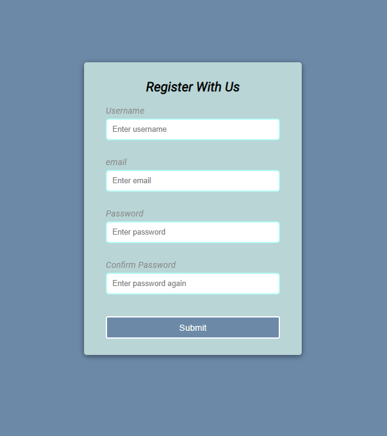
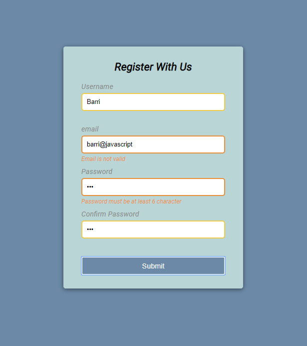

## Form validator app
#
An application used to validate user inputs to a  form (such as valid email, match passwords ) build with javascript , HTML and CSS.
#
### Project Screen Shot

### Project detail: 
I made this project to practice my VanillaJS skills. I learnt: 
- How to  make and run functions
- How to refactor codes 
- Css and styling 

